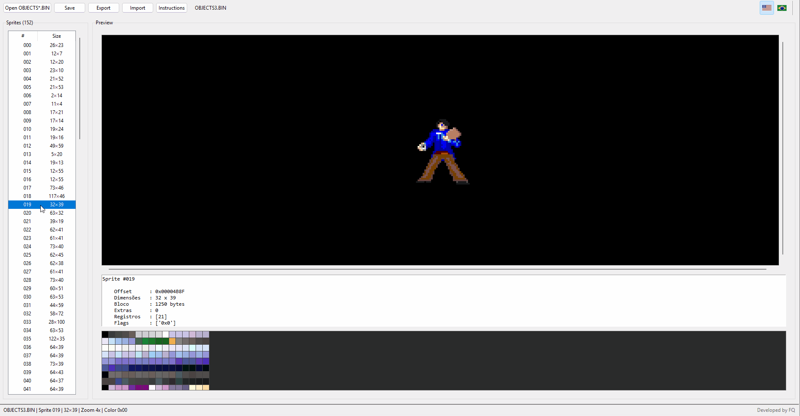
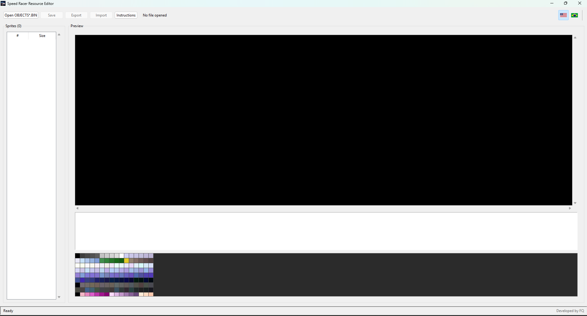
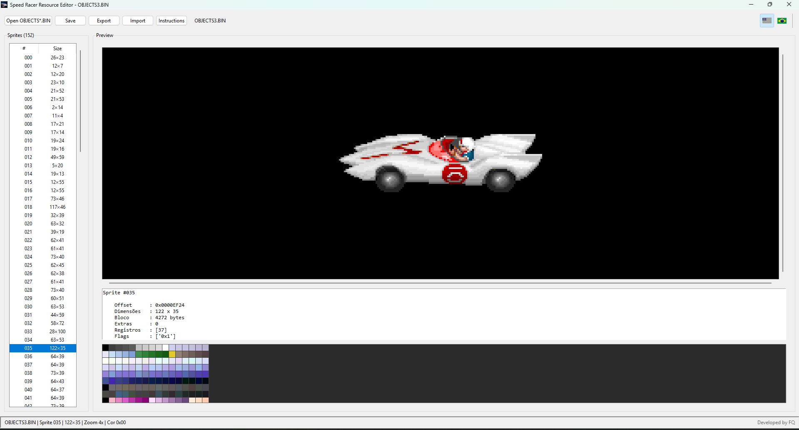

# 🏎️ Speed Racer Resource Editor

A modern resource editor for **Speed Racer: The Challenge of Racer X (MS-DOS)**.

The editor allows viewing, editing, importing and exporting sprites stored in the game's `OBJECTS*.BIN` files.




## Features

- Open OBJECTS1.BIN, OBJECTS2.BIN and OBJECTS3.BIN
- Automatic sprite detection
- Sprite preview
- Pixel editor
- 256-color palette
- Eyedropper tool
- PNG import
- PNG export
- Multiple export scales
- Automatic backup before saving
- English / Portuguese interface
- Windows executable

## Requirements

- Python 3.12+
- Pillow
- NumPy

```bash
pip install -r requirements.txt
```

## Running

```bash
python main.py
```

## Building

```bash
pyinstaller --onefile --windowed --icon assets/icon.ico "Speed Racer Resource Editor.spec"
```

## Screenshots




## License

MIT License.
